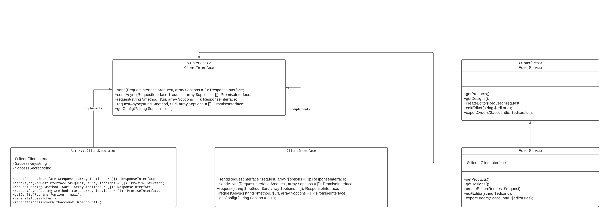
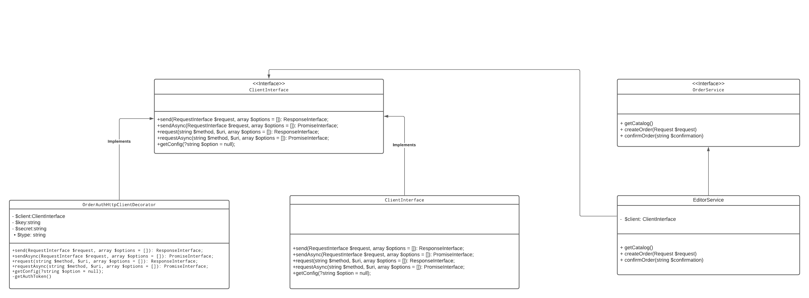

### WHCC PHP API Integration

Implementation of [WHCC API](https://developer.whcc.com/docs/).

The package also provides two Request classes for more complex requests - `CreateEditorRequest` and `CreateOrderRequest`.


#### Basic Examples:

```
<?php

use GuzzleHttp\Client;
use Peac36\Whcc\Decorators\AuthHttpClientDecorator;
use Peac36\Whcc\Service\EditorService;

$client = new Client([
    'base_uri' => <%whcc_base_url%>,
]);

$authClient = new AuthHttpClientDecorator($client, <%whcc_access_key%>, <%whcc_access_secret%>);
$service = new EditorService($authClient);
$service->getProducts();
```

```
<?php

use GuzzleHttp\Client;
use Peac36\Whcc\Decorators\OrderAuthHttpClientDecorator;
use Peac36\Whcc\Service\OrderService;

$client = new Client([
    'base_uri' => "<%whcc_api_url%>/api",
]);

$authClient = new  OrderAuthHttpClientDecorator($client, <%whcc_access_key%>, <%whcc_access_secret%>);
$service = new OrderService($authClient);
$service->getCatalog();
```


#### UML Diagrams

##### Editor Service



##### Order Service

